# DOT 文件可视化指南

本指南说明如何使用 Graphviz DOT 文件生成 ArkUI 生命周期调用图的可视化图片。

## 📋 目录

- [什么是 DOT 文件](#什么是-dot-文件)
- [安装 Graphviz](#安装-graphviz)
- [生成可视化图片](#生成可视化图片)
- [输出格式选项](#输出格式选项)
- [在线可视化](#在线可视化)
- [进阶使用](#进阶使用)

---

## 什么是 DOT 文件

DOT 是 Graphviz 图形描述语言的文本格式，用于描述图（Graph）的结构。

**示例**（`output1.dot`）：

```dot
digraph LifecycleCallGraph {
  rankdir=TB;  // 从上到下布局
  node [shape=box, style=rounded];  // 节点样式

  // 定义节点
  "SimpleDemo.aboutToAppear" [
    label="SimpleDemo.aboutToAppear\n[component]\n组件即将出现时触发",
    fillcolor="lightgreen",
    style="rounded,filled"
  ];

  // 定义边（调用关系）
  "SimpleDemo.aboutToAppear" -> "SimpleDemo.build";
  "SimpleDemo.build" -> "SimpleDemo.onDidBuild";
}
```


**解释**：
- `digraph`：有向图
- `rankdir=TB`：布局方向（Top to Bottom）
- `->`：表示调用关系（A → B 表示 A 调用后执行 B）
- 节点包含：函数名、作用域、描述

---

## 安装 Graphviz

### Windows

**方法 1：使用 Chocolatey**（推荐）
```bash
choco install graphviz
```

**方法 2：手动安装**
1. 访问 https://graphviz.org/download/
2. 下载 Windows 安装包
3. 运行安装程序
4. 添加到系统 PATH：`C:\Program Files\Graphviz\bin`

**验证安装**：
```bash
dot -V
# 输出：dot - graphviz version X.X.X
```

### macOS

```bash
brew install graphviz
```

### Linux

**Ubuntu/Debian**：
```bash
sudo apt-get update
sudo apt-get install graphviz
```

**CentOS/RHEL**：
```bash
sudo yum install graphviz
```

---

## 生成可视化图片

### 基本用法

```bash
# 进入输出目录
cd data/outputs/visualizations

# 生成 PNG 图片
dot -Tpng output1.dot -o output1.png

# 生成 SVG 图片（矢量格式，推荐）
dot -Tsvg output1.dot -o output1.svg

# 生成 PDF
dot -Tpdf output1.dot -o output1.pdf
```

### 批量生成

**Windows (PowerShell)**：
```powershell
# 生成所有 DOT 文件为 PNG
Get-ChildItem *.dot | ForEach-Object {
    dot -Tpng $_.Name -o ($_.BaseName + ".png")
}
```

**Linux/macOS (Bash)**：
```bash
# 生成所有 DOT 文件为 PNG
for file in *.dot; do
    dot -Tpng "$file" -o "${file%.dot}.png"
done
```

### 使用不同布局引擎

Graphviz 提供多种布局引擎：

| 引擎 | 适用场景 | 命令 |
|------|----------|------|
| `dot` | 有向图、层次结构（默认，推荐） | `dot -Tpng input.dot -o output.png` |
| `neato` | 无向图、春力模型 | `neato -Tpng input.dot -o output.png` |
| `fdp` | 无向图、力导向布局 | `fdp -Tpng input.dot -o output.png` |
| `sfdp` | 大型图、多尺度布局 | `sfdp -Tpng input.dot -o output.png` |
| `circo` | 圆形布局 | `circo -Tpng input.dot -o output.png` |

**示例**：
```bash
# 尝试不同布局
dot -Tpng output1.dot -o output1_dot.png
neato -Tpng output1.dot -o output1_neato.png
fdp -Tpng output1.dot -o output1_fdp.png
```

---

## 输出格式选项

### 常用格式

| 格式 | 后缀 | 说明 | 命令 |
|------|------|------|------|
| **PNG** | `.png` | 位图，通用格式 | `dot -Tpng input.dot -o output.png` |
| **SVG** | `.svg` | 矢量图，可缩放，推荐 | `dot -Tsvg input.dot -o output.svg` |
| **PDF** | `.pdf` | 矢量图，适合打印 | `dot -Tpdf input.dot -o output.pdf` |
| **JPEG** | `.jpg` | 位图，有损压缩 | `dot -Tjpg input.dot -o output.jpg` |
| **GIF** | `.gif` | 位图，支持动画 | `dot -Tgif input.dot -o output.gif` |
| **PS** | `.ps` | PostScript | `dot -Tps input.dot -o output.ps` |
| **JSON** | `.json` | JSON 格式的图数据 | `dot -Tjson input.dot -o output.json` |

### 高级选项

**调整 DPI（分辨率）**：
```bash
# 高分辨率 PNG（默认 96 DPI）
dot -Tpng -Gdpi=300 output1.dot -o output1_hires.png
```

**设置图片大小**：
```bash
# 设置最大宽度/高度（英寸）
dot -Tpng -Gsize="10,8!" output1.dot -o output1_large.png
```

**背景透明**：
```bash
# PNG 透明背景
dot -Tpng -Gbgcolor=transparent output1.dot -o output1_transparent.png
```

---

## 在线可视化

如果无法安装 Graphviz，可以使用在线工具：

### 推荐在线工具

1. **Graphviz Online**
   - 网址：https://dreampuf.github.io/GraphvizOnline/
   - 使用：复制 DOT 文件内容，粘贴到左侧编辑器
   - 功能：实时预览、下载 PNG/SVG

2. **Edotor**
   - 网址：https://edotor.net/
   - 功能：在线编辑、实时渲染

3. **SketchViz**
   - 网址：https://sketchviz.com/new
   - 功能：手绘风格可视化

### 使用步骤

1. 打开在线工具网址
2. 复制 `output1.dot` 文件的全部内容
3. 粘贴到左侧编辑器
4. 右侧自动显示可视化结果
5. 下载图片（PNG/SVG）

---

## 进阶使用

### 自定义样式

编辑 DOT 文件，修改节点和边的样式：

**修改节点颜色**：
```dot
"SimpleDemo.aboutToAppear" [
  label="SimpleDemo.aboutToAppear\n[component]\n...",
  fillcolor="lightblue",  // 修改为浅蓝色
  style="rounded,filled"
];
```

**修改边的样式**：
```dot
"SimpleDemo.aboutToAppear" -> "SimpleDemo.build" [
  color="red",         // 红色边
  penwidth=2.0,        // 边宽度
  style="dashed"       // 虚线
];
```

**修改布局方向**：
```dot
digraph LifecycleCallGraph {
  rankdir=LR;  // 从左到右（Left to Right）
  // 或 rankdir=RL; // 从右到左
  // 或 rankdir=BT; // 从下到上
}
```

### 与其他工具集成

**嵌入到 Markdown**（GitHub/GitLab）：
```markdown

```

**嵌入到 HTML**：
```html

```

**在 Jupyter Notebook 中显示**：
```python
from IPython.display import SVG, display
display(SVG('data/outputs/visualizations/output1.svg'))
```

---

## 完整示例工作流

### 端到端生成可视化

```bash
# 1. 激活虚拟环境
conda activate CreatPPT

# 2. 运行 Python RAG 分析
python main.py analyze --output lifecycle_analysis.json

# 3. 运行 TypeScript 生成 DOT 文件
npm run visualize

# 4. 生成 PNG 图片
cd data/outputs/visualizations
dot -Tpng lifecycle_analysis.dot -o lifecycle_analysis.png

# 5. 生成高清 SVG
dot -Tsvg lifecycle_analysis.dot -o lifecycle_analysis.svg

# 6. 打开图片查看
# Windows
start lifecycle_analysis.png

# macOS
open lifecycle_analysis.svg

# Linux
xdg-open lifecycle_analysis.png
```

---

## 常见问题

### Q: dot 命令找不到

**A**: 确保 Graphviz 已安装并添加到 PATH：
```bash
# Windows
echo %PATH%  # 检查是否包含 C:\Program Files\Graphviz\bin

# Linux/macOS
which dot  # 应该输出 /usr/bin/dot 或类似路径
```

### Q: 中文显示乱码

**A**: 指定字体：
```bash
dot -Tpng -Nfontname="Microsoft YaHei" output1.dot -o output1.png
```

或在 DOT 文件中添加：
```dot
digraph LifecycleCallGraph {
  node [fontname="Microsoft YaHei"];
  edge [fontname="Microsoft YaHei"];
  // ...
}
```

### Q: 图片太大或太小

**A**: 调整 DPI 和尺寸：
```bash
# 增加分辨率
dot -Tpng -Gdpi=200 output1.dot -o output1.png

# 限制尺寸
dot -Tpng -Gsize="8,6!" output1.dot -o output1.png
```

### Q: 想要交互式查看

**A**: 使用 `xdot`（交互式查看器）：
```bash
# 安装 xdot
pip install xdot

# 打开 DOT 文件
xdot output1.dot
```

---

## 参考资源

- **Graphviz 官方文档**：https://graphviz.org/documentation/
- **DOT 语言规范**：https://graphviz.org/doc/info/lang.html
- **节点和边属性**：https://graphviz.org/doc/info/attrs.html
- **颜色名称列表**：https://graphviz.org/doc/info/colors.html

---

## 下一步

生成可视化图片后，你可以：

1. **插入到文档**：将图片添加到技术文档、设计文档中
2. **代码审查**：用于团队讨论生命周期调用顺序
3. **教学演示**：帮助理解 ArkUI 组件生命周期
4. **调试分析**：可视化复杂的调用关系，排查问题

**Happy Visualizing! 🎨**
